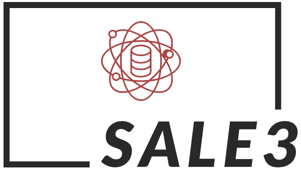

# kaydash.github.io

## 프로젝트 개요

이 프로젝트는 네트워크 인프라의 주요 노드와 통신 경로를 시각적으로 표현하는 웹사이트입니다. 네트워크 구조, 서비스 흐름, 각 노드의 역할을 한눈에 볼 수 있도록 설계되었습니다.

## 배포 및 도메인 정보
- **GitHub Pages**를 통해 서비스: [http://kaydash.github.io](http://kaydash.github.io)
- **커스텀 도메인** 연결: [http://shbank.me](http://shbank.me)
- CNAME 파일을 통해 도메인 연결 관리

## 주요 기능
- index.html에서 네트워크 아키텍처를 시각적으로 표현
- 각 노드(서버, 게이트웨이, 외부망 등)와 통신 경로를 아이콘 및 선분으로 표시
- 직선, 꺾인선, 점선 등 다양한 선 스타일로 네트워크 흐름 표현
- 주요 노드 및 서비스에 대한 정보(아이콘, IP, 역할 등) 제공

## 폴더 및 파일 구조

| 경로/폴더                | 설명                                      |
|--------------------------|-------------------------------------------|
| index.html               | 메인 네트워크 시각화 페이지               |
| 404.html, 50x.html       | 에러 페이지                               |
| CNAME                    | 커스텀 도메인 연결 정보                   |
| README.md                | 프로젝트 설명 파일                        |
| NEW_LOGO/                | 로고 및 이미지 리소스 폴더                |
| resourcesHTML/           | CSS, JS, CSV 등 부가 리소스 폴더          |
| resourcesHTML/getImgs/   | 네트워크 구성요소 및 서비스 이미지        |
| pve1_components.csv 등   | 네트워크/서버 구성 CSV 데이터             |
| topology.html, nw_map.html, index3.html, index_old.html | 기타 시각화/테스트 페이지 |
| nginx-logo.png, poweredby.png | 기타 이미지 파일                    |

## 사용 방법
1. GitHub Pages를 통해 자동 배포됩니다.
2. 메인 페이지([index.html](index.html))를 통해 네트워크 구조를 확인할 수 있습니다.
3. 커스텀 도메인([shbank.me](http://shbank.me))로도 접속 가능합니다.

## 참고 사항
- 네트워크 구조 및 노드 배치는 index.html 내 스크립트에서 직접 수정할 수 있습니다.
- 추가적인 이미지 및 데이터 파일은 `getImgs/`, `resourcesHTML/` 폴더에 위치합니다.

---

문의 및 피드백: [GitHub Issues](https://github.com/kaydash/kaydash.github.io/issues)